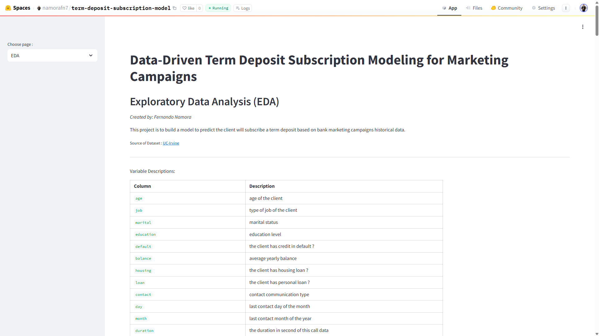
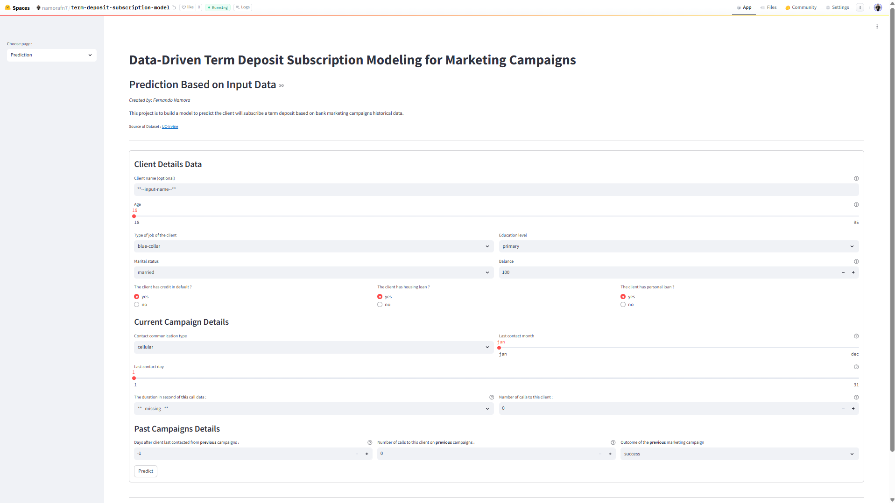
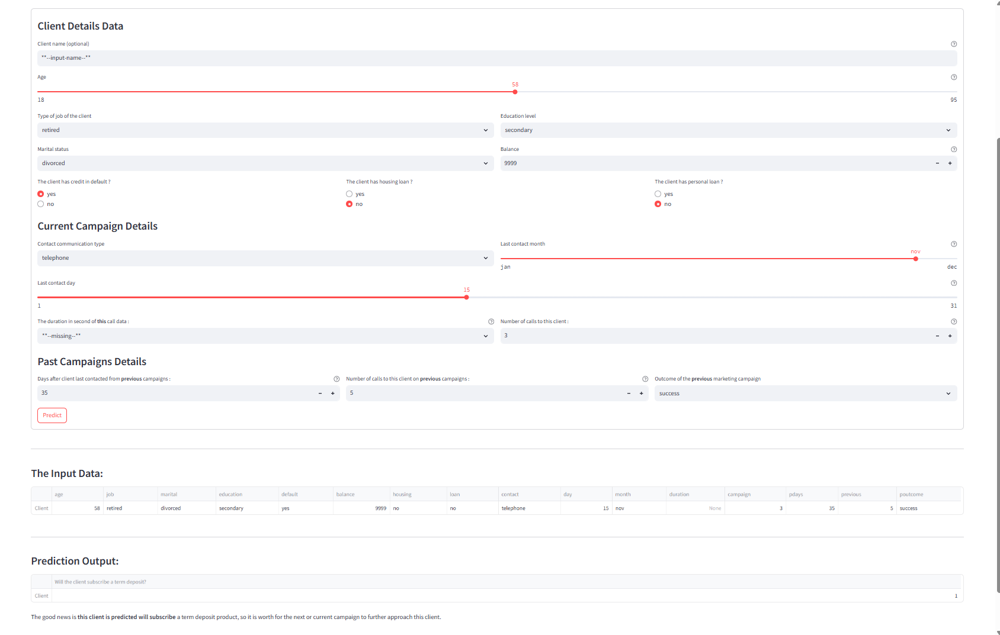

# Data-Driven Term Deposit Subscription Modeling for Marketing Campaigns
*[Live Demo on Hugging Face Spaces](https://huggingface.co/spaces/namorafn7/term-deposit-subscription-model)* <br>
For website application details and instructions, please refer to the [Model Deployment section](##model-deployment)

## Repository Outline

```
term-deposit-subscription-model
|
├── deployment/
│   ├── src/
│   │   ├── streamlit_app.py            # Streamlit app for model deployment core
│   │   ├── eda.py                      # Model deployment EDA section with streamlit
│   │   └── prediction.py               # Model deployment prediction based on user input with streamlit
│   ├── Dockerfile                      # Dockerfile for Hugging Face deployment
│   └── requirements.txt                # Installations python libraries for model deployment
├─ notebook.ipynb                       # Notebook of modeling process for prediction term deposit subscriber based on bank marketing campaigns historical data
├─ notebook_inferenec.ipynb             # Notebook of inference model from main notebook to predict data inference
├─ bankfull.csv                         # Original dataset from UCI Machine Learning Repository
├─ term_depo_predictor.pkl              # The model created from `notebook.ipynb`
├─ requirements.txt                     # Python dependencies
└─ README.md                            # Project overview explanation
```

## Stacks

All of the program used in notebook used **python** programming language :
- **EDA libraries**: `pandas`, `numpy`, `scipy`, `matplotlib`, `seaborn`
- **Machine Learning libraries**: `scikit-learn`, `feature_engine`, `phik`
- **Built-in libraries** for model saving: `pickle`
> Versions of libraries used: `scipy==1.13.1`, `phik==0.12.5`, `scikit-learn==1.6.1`, and `feature_engine==1.8.3`   

To install dependencies, kindly install all stacks on `requirements.txt`
```py
pip install -r requirements.txt
```
> **Version of python used: 3.9**

---


## Problem Background

Deposits are an important source of stable funding for banks. One of the financial instruments offered by banks to support capital growth and funding stability is **the term deposit**. The dataset comes from a Portuguese banking institution namely The Bank, that conducted **direct marketing campaigns through phone calls**. The objective of these campaigns was to encourage customers to **subscribe to term deposit** products. However, not all contacted customers were ended up subscribing, resulting in inefficient use of marketing resources. It is needed to build a **predictive model to identify customers who are more likely to subscribe to a term deposit**. By predicting customer subscription behavior, the Bank can target specific potential customers more effectively and improve the efficiency for **future marketing campaigns**.


## Project Output

This project output includes business understanding, data understanding, exploratory data analysis (EDA), feature engineering, and the modeling process that resulted to be used for future marketing campaigns. The modeling process involves a comparison of five algorithms: KNN, SVM, Decision Tree, Random Forest, and AdaBoost. The best model is selected using the precision score and cross-validation within a pipeline to ensure an end-to-end process while preventing data leakage from the test set. The selected best model then conducted hyperparameter tuning to find best hyperparameter. The final selected model then evaluated with confusion matrix, results with precision score higher than 70 % on both training and test dataset, and can be used for model inference with unseen data. The EDA and machine learning model also deployed on Hugging Face platform.

### Python Notebook Outline (main notebook)

- **i. Introduction**:
  > The introduction of the author information, dataset source and information, problem statement, and objective for this project
- **ii. Import Libraries**: <br> 
  > All libraries that will be used in this project
- **iii. Data Loading**: <br> 
  > The process for data loading and simple exploration
- **iv. Exploratory Data Analysis (EDA)**: <br>
  > The simple data data analysis exploration and visualization to answer business-related questions from historical dataset
- **v. Feature Engineering**: <br>
  > All preprocessing process for features includes train-test split, cardinality handling, missing value and outliers handling, feature selection, and feature transformation analysis. All these process later wrapped inside pipeline of preprocessor to be used for end-to-end process of model training process
- **vi. Model Definition**: <br>
  > The section to define model, algorithms that are used, hyperparameter used and chosen metric for evaluation
- **vii. Model Training**: <br>
  > The section to train model with training data
- **viii. Model Evaluation**: <br>
  > Model evaluation analysis with chosen metrics, hyperparameter tuning, and analysis includes advantageous and weakness of the selected model
- **ix. Model Saving**: <br>
  > Saving process of the selected model to be used in the model inference and model deployment
- **x. Model Inference**: <br>
  > This section is done on different notebook
- **xi. Conclusion**: <br>
  > Conclusion of the overall process of this project includes EDA, modeling process, the resulted model, and model evaluation with related information and analysis to answer business problem stated in objective section

---

## Data

Source of Dataset: [UC-Irvine](https://archive.ics.uci.edu/dataset/222/bank+marketing)

| Column | Description |
| --- | --- |
| `age` | age of the client |
| `job` | type of job of the client |
| `marital` | marital status |
| `education` | education level |
| `default` | the client has credit in default ? |
| `balance` | average yearly balance |
| `housing` | the client has housing loan ? |
| `loan` | the client has personal loan ? |
| `contact` | contact communication type |
| `day` | last contact day of the month |
| `month` | last contact month of the year |
| `duration` | the duration in second of this call data |
| `campaign` | number of contacts performed during this campaign and for this client |
| `pdays` | number of days that passed by after the client was last contacted from a previous campaign (-1 means the client was not previously contacted) |
| `previous` | number of contacts performed before this campaign and for this client |
| `poutcome` | outcome of the previous marketing campaign |
| `y` | has the client subscribed a term deposit ? |

Dataset characteristics:

- Total 45211 rows and 17 columns (include `y`)
- No missing values (of 17 columns above)


## Method

The modeling approach in this project consists of the below steps:

1. **Model Comparison**   
    Five machine learning algorithms (**KNN, SVM, Decision Tree, Random Forest, and AdaBoost**) are compared to address a **binary classification task**, with **precision score** as the main evaluation metric since the objective of minimizing false positives

2. **Model Selection and Hyperparameter Tuning**   
    The selected base model is further optimized with hyperparameter tuning to find best hyperparameter that reduced bias and variance, more stable and regularized model.

3. **Pipeline and Cross-Validation**   
    All preprocessing steps and model training are wrapped in an **end-to-end pipeline** with **cross-validation** technique. So that the model selection will prevent data leakage and avoid overfit to the test set while training and tuning.

4. **Final Evaluation and Interpretation**   
    The final tuned model is evaluated using **confusion matrix** on both training and test sets. The results are analyzed of **advantages and weaknesses** of the model and refer to business-related domain from the main objective to improve marketing campaign targeting.

---

## Model Deployment

For live model interaction, kindly visit the following link *[Hugging Face Model Deployment Link](https://huggingface.co/spaces/namorafn7/term-deposit-subscription-model)*.

The deployed application consists of two main pages:

1. **EDA page**   
   This page presents visualizations and insights based on the historical dataset (`bank-full.csv`).   
   Users can explore the data patterns and unsertand the background analysis used before modeling.
2. **Prediction page**   
   This page allows users to input customer information and obtain real-time predictions from the deployed machine learning model built with Streamlit.

### Screenshots of the Web Application

- **EDA Page** <br>
   <br>
  Visitors can scroll through the page to explore interactive visualizations and insights.
- **Prediction Page** <br>
   <br>
  This page provides the user interface for entering customer data.
- **Prediction Example** <br>
   <br>
  Example of a prediction result generated from user input.